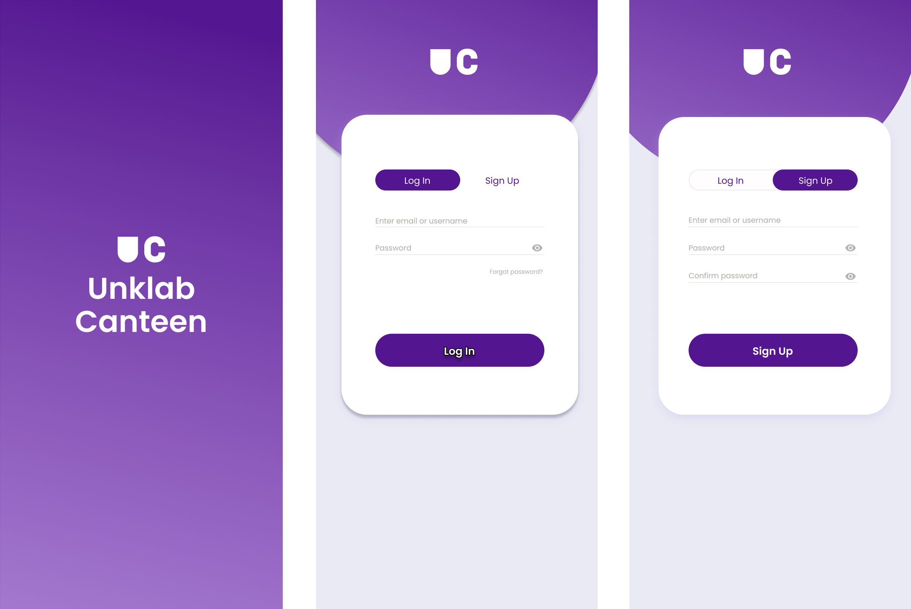
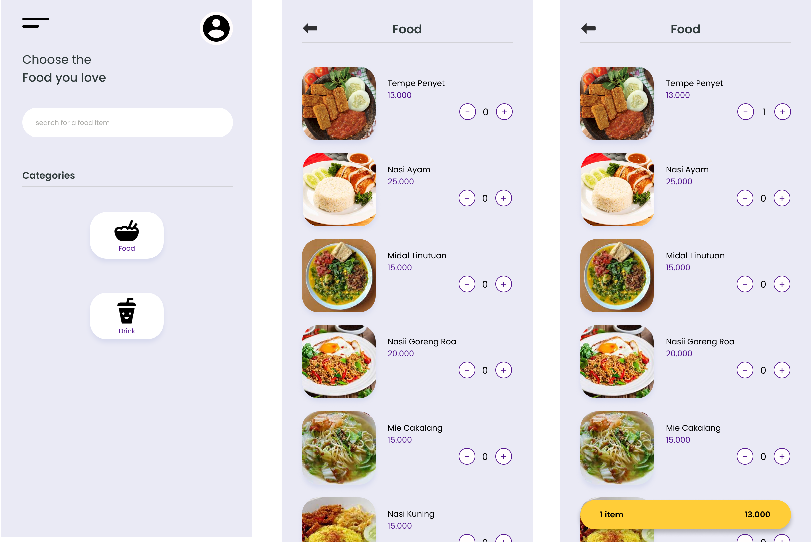
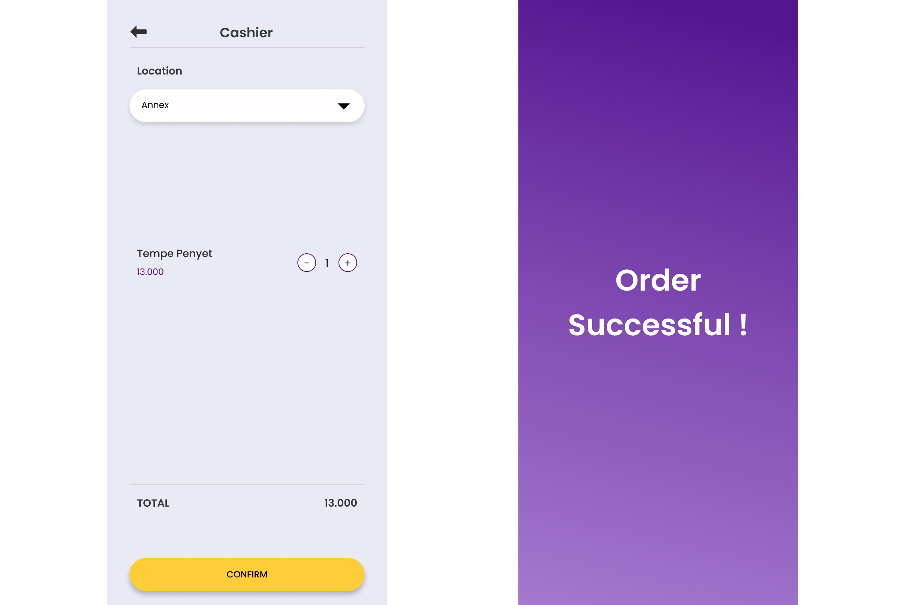

## Unklab Canteen

This Mobile Application Project is the final project for the Mobile Application Development course using React Native by the Tokyo group consisting of 4 members. I am responsible for several pages as well as the backend part.

The end result will be like this.

